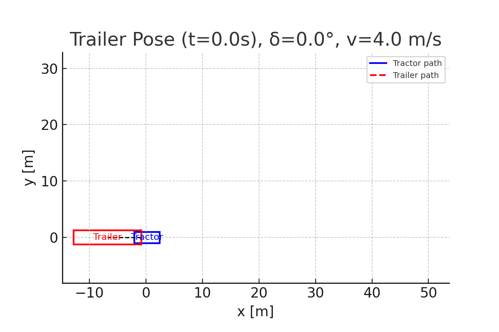

# 🚛 Articulated Vehicle Kinematic Simulation

This repository demonstrates a simplified **tractor–trailer kinematic model**, inspired by the Berkeley Fire Truck system.  
It simulates the geometric relationship between a tractor and its trailer during maneuvers such as lane changes and ramp merges.

---

## 🧩 Model Overview

The vehicle is modeled using the following nonholonomic kinematics:

$$
\begin{aligned}
\dot{x} &= v\cos\theta,\\
\dot{y} &= v\sin\theta,\\
\dot{\theta} &= \frac{v}{L_1}\tan\delta,\\
\dot{\psi} &= \frac{v}{L_2}\sin(\theta - \psi)
\end{aligned}
$$

where

**where**

| Symbol       | Meaning                                 |
|--------------|-----------------------------------------|
| $v$          | longitudinal speed                      |
| $\delta$     | front steering angle                    |
| $\theta$     | tractor heading                         |
| $\psi$       | trailer heading                         |
| $L_1, L_2$   | wheelbase and hitch-to-trailer distance |

---

## 🎬 Simulation Demo

Below is a demonstration of the simulated **trailer pose evolution**:

*(Blue: tractor path, Red: trailer path)*
